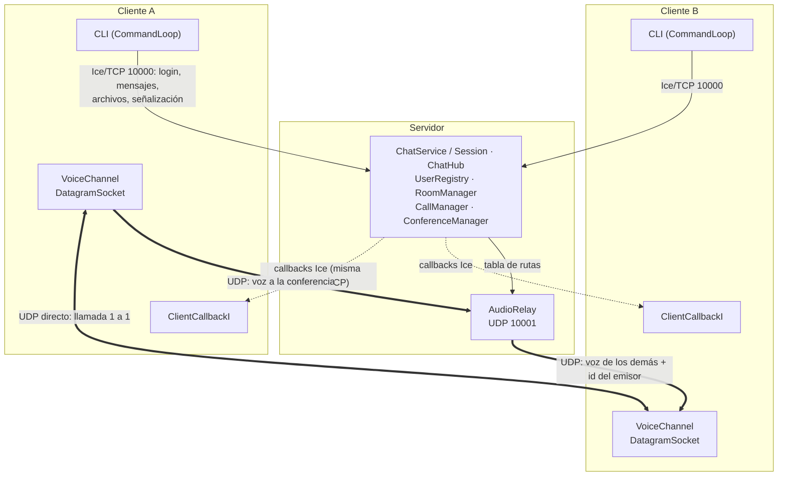
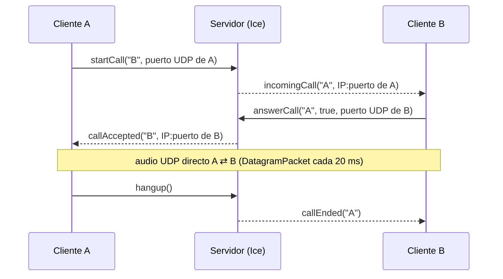

# Chat Ice — Chat multimedia y voz UDP con ZeroC Ice

Taller Evaluativo Unidad 2 · Computación en Internet I (09810) · Universidad Icesi · 2026-2

Plataforma distribuida de comunicación en tiempo real (tipo Discord/Slack):

- **ZeroC Ice (TCP):** sesión, presencia, chat privado y grupal, transferencia de archivos y señalización de llamadas.
- **UDP (`DatagramSocket`):** transmisión de voz en llamadas 1 a 1 y conferencias grupales.

> **¿Vas a trabajar en el proyecto?** Lee primero [GUIA_EQUIPO.md](GUIA_EQUIPO.md): qué está hecho, qué falta y cómo continuar (también sirve de contexto para asistentes de IA).

**Contenido:** [Integrantes](#integrantes) · [Requisitos](#requisitos) · [Ejecución](#ejecución) · [Arquitectura](#arquitectura) · [Manual de usuario](#manual-de-usuario) · [Estructura](#estructura-del-proyecto) · [Decisiones de diseño](#decisiones-de-diseño) · [Cuestionario](#cuestionario-de-análisis-conceptual) · [Bitácora de IA](#bitácora-de-uso-de-ia)

## Integrantes

| Nombre | Código |
|---|---|
| Juan Felipe Martinez Palacios | A00412033 |
| Juan Andres Cano Torres | A00 |
| Elias Saldarriaga | A00 |

## Requisitos

| Herramienta | Versión | Notas |
|---|---|---|
| JDK | 17 o superior (probado con 23 y 25) | |
| ZeroC Ice | 3.7.x | Solo se necesita el compilador `slice2java`; la librería Java la descarga Gradle |
| Gradle | No hace falta instalarlo | Se usa el wrapper incluido (`gradlew`) |

### Instalar Ice 3.7 (`slice2java`)

- **macOS:** `brew tap zeroc-ice/tap && brew install zeroc-ice/tap/ice@3.7`
- **Windows:** instalador MSI de Ice 3.7 desde https://zeroc.com/ice/downloads/3.7/java (sección *Windows Installer*)
- **Linux (Debian/Ubuntu):** paquete `zeroc-ice-compilers` del repositorio de ZeroC

El build localiza Ice buscando `slice2java` en el `PATH`. Si no lo encuentra, se indica con la variable de entorno `ICE_HOME` o con `-PiceHome=<ruta>`. En Windows, por ejemplo:

```powershell
.\gradlew.bat build "-PiceHome=C:\Program Files\ZeroC\Ice-3.7.11"
```

## Ejecución

```bash
./gradlew build                            # compila contratos Slice + servidor + cliente
./gradlew runServer                        # servidor: TCP 10000 (Ice) y UDP 10001 (relay de voz)
./gradlew runClient                        # cliente contra localhost
./gradlew runClient -Phost=192.168.1.20    # cliente contra otra máquina de la red
```

En Windows se usa `gradlew.bat` en lugar de `./gradlew` (desde PowerShell o CMD).

Para abrir varios clientes más rápido, sin pasar por Gradle cada vez:

```bash
./gradlew installDist
client/build/install/client/bin/client --Ice.Config=config/client.config
```

**Red y firewall:** en la máquina del servidor deben poder entrar conexiones **TCP 10000** y **UDP 10001**. En las de los clientes, Java debe poder recibir UDP (Windows lo pregunta la primera vez: aceptar en *redes privadas*).

## Arquitectura

El sistema separa dos canales. **Ice (TCP)** lleva todo lo que necesita llegar completo y en orden: sesión, mensajes, archivos y la señalización de las llamadas. **UDP** lleva solo la voz, donde importa más llegar a tiempo que llegar todo.



### Flujo Ice (señalización, mensajes y archivos)

- **Una sola conexión TCP por cliente.** El cliente se conecta al objeto `ChatService` (proxy directo `ChatService:tcp -h <host> -p 10000`) y hace `login(nickname, callback)`. Recibe un proxy a su propia `Session`, sobre la que invoca todo lo demás.
- **Callbacks por la misma conexión.** El servidor avisa de forma asíncrona (`...Async`) a través de la interfaz `ClientCallback`, que implementa el cliente: mensajes, presencia, fragmentos de archivo, llamadas entrantes y conferencias. Viajan por la misma conexión TCP, así el cliente no abre ningún puerto TCP.
- **Archivos.** Se fragmentan en chunks de 64 KB (`sequence<byte>`). El servidor valida cada fragmento y lo reenvía al destinatario, o a todos los miembros de la sala, sin guardarlo.

### Flujo UDP (voz)

- **Llamada 1 a 1:** Ice solo coordina (`startCall` → `incomingCall` → `answerCall` → `callAccepted`). Cada cliente anuncia su puerto UDP y el servidor completa la IP con la que ve en la conexión TCP. Después el audio va **directo entre los dos clientes**; el servidor nunca lo ve.
- **Conferencia (relay centralizado):** `joinVoice(sala)` devuelve el endpoint UDP del relay del servidor. Cada cliente le envía su voz, y el relay la reenvía a los demás participantes de la sala, nunca de vuelta a quien la envió. Antepone 2 bytes con el id del emisor para que el cliente receptor pueda mezclar las voces (`AudioMixer`).
- **Formato del audio:** PCM de 16 bits, mono, 16 kHz, en paquetes de 20 ms (640 bytes, 50 paquetes por segundo), capturado y reproducido con `javax.sound.sampled`.



## Manual de usuario

La interfaz es una CLI (opción A del taller). Los mensajes que llegan aparecen en cualquier momento sin interrumpir lo que se está escribiendo. El prompt muestra el usuario y la sala activa, por ejemplo `ana #redes>`.

### Comandos

| Comando | Descripción |
|---|---|
| `/login <nickname>` | Inicia sesión (nickname único, de 2 a 20 caracteres, sin espacios) |
| `/logout` | Cierra la sesión |
| `/users` | Lista los usuarios conectados |
| `/msg <usuario> <texto>` | Mensaje privado |
| `/create <sala>` | Crea una sala y entra a ella |
| `/rooms` | Lista las salas disponibles (`[voz activa]` si hay conferencia en curso) |
| `/join <sala>` | Entra a una sala (se puede estar en varias) |
| `/leave <sala>` | Sale de una sala |
| `/members <sala>` | Lista los miembros de una sala |
| `/room <sala> [texto]` | Envía un mensaje a esa sala; sin texto, la deja como sala activa |
| *texto sin `/`* | Se envía a la sala activa (la que muestra el prompt) |
| `/sendfile <usuario\|#sala> <ruta>` | Envía un archivo (se guarda en `downloads/` del receptor) |
| `/call <usuario>` | Llamada de voz 1 a 1 |
| `/accept`, `/reject` | Acepta o rechaza la llamada entrante |
| `/hangup` | Cuelga (o cancela la llamada que está timbrando) |
| `/voice [sala]` | Entra a la llamada de voz de una sala (por defecto, la activa) |
| `/leavevoice` | Sale de la llamada de voz sin cortar a los demás |
| `/mute`, `/unmute` | Silencia o reactiva el micrófono (en conferencia o en llamada 1 a 1) |
| `/help`, `/quit` | Ayuda y salir |

### Paso a paso

**1. Sesión y presencia.** En cada cliente:

```
> /login ana
Sesión iniciada como ana.
En línea (2): ana (tú), bea
```

Cuando alguien entra o sale, todos ven `* bea se conectó` / `* bea se desconectó`. Si el nickname ya está en uso, el servidor lo rechaza y se puede intentar con otro.

**2. Mensajes privados.**

```
ana> /msg bea hola, ¿cómo vas?
[10:31] [privado → bea] hola, ¿cómo vas?  ✓ entregado al servidor
```

Si `bea` no existe o se desconectó, aparece un error descriptivo.

**3. Salas.** `/create redes` crea la sala y la deja como activa; los demás entran con `/join redes`. Todo lo que se escribe sin `/` va a la sala activa y solo lo reciben sus miembros. Para hablar en otra sala sin cambiar la activa: `/room otra-sala texto`.

**4. Archivos.** Con la ruta del archivo (puede tener espacios; las comillas son opcionales):

```
ana #redes> /sendfile bea C:\Users\ana\Pictures\foto.png
ana #redes> /sendfile #redes informe.pdf
```

El receptor lo encuentra en la carpeta `downloads/`. Ambos lados imprimen el SHA-256 para comprobar que llegó íntegro.

**5. Llamada 1 a 1.** `ana` escribe `/call bea`; a `bea` le aparece `☎ Llamada entrante de ana` y responde con `/accept` o `/reject`. Cualquiera de los dos cuelga con `/hangup`. Durante la llamada, `/mute` y `/unmute` silencian el micrófono propio.

**6. Conferencia en una sala.** Todos los miembros de la sala escriben `/voice` (o `/voice redes`). Cada uno ve quién entra y sale de la llamada, puede usar `/mute` y `/unmute`, y sale con `/leavevoice` sin cortar a los demás. Salir de la sala (`/leave`) o cerrar el cliente también saca de la llamada. No se puede estar en una llamada 1 a 1 y en una conferencia a la vez.

> **Usar audífonos** en las llamadas: no hay cancelación de eco, y sin ellos el micrófono recoge lo que suena por el altavoz.

### Problemas frecuentes

| Síntoma | Solución |
|---|---|
| `slice2java not found` al compilar | Instalar Ice 3.7 e indicar la ruta con `-PiceHome=...` (ver [Requisitos](#requisitos)) |
| El cliente no conecta (`ConnectRefusedException`) | Verificar que el servidor esté corriendo y usar `-Phost=<IP del servidor>`; revisar el firewall (TCP 10000) |
| La llamada se establece pero no se oye nada | El firewall bloquea UDP: permitir Java en redes privadas (en el servidor, UDP 10001 para conferencias) |
| "No se pudo abrir el micrófono" | Otro programa (u otro cliente en el mismo PC) lo está usando, o falta el permiso de micrófono (macOS) |
| Se oye eco | Usar audífonos |

## Estructura del proyecto

```
├── build.gradle            # configuración común + tareas runServer / runClient
├── settings.gradle         # módulos: common, server, client
├── buildSrc/               # puente de compatibilidad del plugin Ice con Gradle 9 (ver abajo)
├── config/
│   ├── server.config       # endpoints, puerto del relay, tamaño máximo de mensaje, hilos, ACM
│   └── client.config       # proxy del servidor, heartbeats
├── common/                 # contratos Slice → stubs Java (paquete co.edu.icesi.chat)
│   └── src/main/
│       ├── slice/
│       │   ├── Types.ice       # structs y excepciones
│       │   ├── Callback.ice    # interfaz ClientCallback (la implementa el cliente)
│       │   └── Service.ice     # interfaces ChatService y Session (las implementa el servidor)
│       └── java/               # FileTransferLimits: reglas de chunking compartidas
├── server/                 # ChatServer, ChatServiceI, SessionI, ChatHub, UserRegistry, RoomManager,
│                           # CallManager, ConferenceManager, AudioRelay
└── client/                 # ChatClient, CommandLoop, *Commands, ClientCallbackI, Console,
                            # FileSender/FileAssembler, CallSession, ConferenceSession,
                            # VoiceChannel, AudioSender/AudioReceiver, AudioMixer
```

## Decisiones de diseño

- **Patrón de sesión:** `ChatService` solo expone `login(nickname, callback)`, que devuelve un proxy `Session*` propio de cada usuario. Las demás operaciones se invocan sobre la sesión, así el servidor siempre sabe quién llama y nadie puede suplantar a otro nickname.
- **Callbacks bidireccionales:** el cliente crea un adaptador de objetos sin endpoints y lo asocia a la conexión ya abierta con el servidor (`Connection.setAdapter`). El servidor invoca los callbacks por esa misma conexión TCP, así el cliente no necesita abrir puertos (útil detrás de NAT o firewalls del laboratorio).
- **Concurrencia en el servidor:** el estado compartido vive en `ConcurrentHashMap`. La unicidad del nickname se resuelve con `putIfAbsent` (atómico) y las altas y bajas de una sala con `computeIfPresent`, que bloquea solo esa sala. Llamadas y conferencias comparten un único lock corto, para que nadie quede en ambas a la vez. Las notificaciones a clientes se envían con invocaciones asíncronas (`...Async`) y fuera de cualquier lock, para que un cliente lento no frene a los demás.
- **Detección de clientes caídos:** el cliente envía latidos (ACM heartbeats); si el servidor deja de recibir actividad durante 15 s cierra la conexión, y el *close callback* de esa conexión limpia la sesión, sus salas, llamadas y conferencias, y avisa a los demás.
- **Salas:** una sala se elimina cuando queda sin miembros. Los nombres de usuarios y salas no distinguen mayúsculas.
- **Archivos:** chunks de 64 KB fijos (máximo 256 MB por archivo). El emisor envía de a un fragmento y espera la confirmación antes del siguiente, así no acumula fragmentos en memoria. El receptor escribe cada fragmento en `índice × 64 KB`, en un hilo propio y en un archivo temporal que solo se renombra al completarse.
- **Direcciones UDP:** el cliente declara solo su puerto; el servidor pone la IP que ve en la conexión TCP. Así nadie puede desviar el audio de otro hacia una máquina ajena.
- **Conferencias de voz:** relay centralizado en el servidor (SFU ligero), en el puerto UDP 10001 (`AudioRelay.Port` en `server.config`). Reenvía la voz de cada participante a los demás de la sala, nunca a quien la envió, y antepone el id del emisor (2 bytes). Cada cliente mezcla las voces que recibe (`AudioMixer`): sin mezclar, con 3 o más personas el altavoz recibiría más audio del que puede reproducir.
- **Plugin de Ice con Gradle 9:** el taller exige `com.zeroc.gradle.ice-builder.slice` (1.5.2), compilado contra Groovy 3. Gradle 9, necesario para compilar con JDK 25, trae Groovy 4, que movió `groovy.util.XmlSlurper` a `groovy.xml.XmlSlurper`. `buildSrc/` contiene una clase puente de pocas líneas que restaura ese nombre para que el plugin funcione.

## Cuestionario de análisis conceptual

### 1. Arquitectura híbrida TCP/UDP

**Por qué separar los canales.** Los dos tipos de tráfico exigen garantías opuestas:

- **Control, chat y archivos necesitan fiabilidad y orden.** Si se pierde un fragmento, el archivo queda corrupto. Si se pierde un `hangup`, el estado de la llamada queda inconsistente. Si dos mensajes llegan desordenados, la conversación pierde sentido. TCP garantiza todo eso, e Ice agrega contratos tipados, excepciones de aplicación (`UserNotFoundException`, `CallException`...), callbacks asíncronos y gestión de conexiones (ACM). Escribir eso a mano sobre sockets sería reinventar Ice.
- **La voz necesita puntualidad, no completitud.** Cada paquete lleva 20 ms de audio con un plazo: si llega tarde ya no sirve. Perder uno se oye como un chasquido de 20 ms; esperarlo congela todo lo que viene detrás. UDP entrega cada datagrama apenas llega, o lo pierde, y deja a la aplicación decidir qué hacer. En nuestro cliente, el altavoz tiene un colchón de unos 160 ms y descarta paquetes si se llena, para no acumular retraso. El mezclador de conferencias descarta lo más viejo si alguien se atrasa más de 100 ms.

**Qué pasaría si la voz fuera por Ice/TCP con jitter o pérdida de paquetes:**

1. **Bloqueo de cabeza de línea (head-of-line blocking).** TCP entrega en orden. Si se pierde un segmento, todo lo que llegó después queda retenido en el sistema operativo hasta la retransmisión: al menos un RTT (fast retransmit), o cientos de milisegundos si expira el temporizador (RTO, mínimo 200 ms en Linux). Con paquetes cada 20 ms, una sola pérdida congela 10 o más paquetes que en realidad sí llegaron. Se oye un silencio y después una ráfaga.
2. **Latencia acumulada.** Tras la ráfaga hay dos opciones. Reproducir todo, y la conversación queda atrasada para siempre. O descartar lo atrasado, y entonces la retransmisión no sirvió de nada. En ambos casos TCP solo agrega costo.
3. **Control de congestión.** Ante una pérdida, TCP reduce su ventana de envío a la mitad (o más). El emisor se frena justo cuando el audio necesita un caudal constante (unos 256 kbit/s en nuestro formato).
4. **Costo propio de Ice.** Cada invocación lleva cabecera de protocolo (14 bytes) más la cabecera de petición: identidad, nombre de la operación, modo, contexto y encapsulación, del orden de 80 bytes sobre 640 de audio. Una invocación *twoway* además espera la respuesta, lo que limita a un paquete por RTT. Y el audio compartiría la conexión TCP con el chat y los archivos: un chunk de 64 KB en cola retrasaría la voz aunque la red estuviera perfecta.
5. **Jitter.** TCP no lo elimina, lo convierte en retrasos más grandes por las retransmisiones. Con UDP el jitter se absorbe con un colchón de pocos paquetes y las pérdidas se ocultan (se oyen como un chasquido).

### 2. Manejo de buffer y chunking en Ice

**Qué pasa con un video de 80 MB en una sola invocación.** Ice limita el tamaño de cada mensaje con `Ice.MessageSizeMax`: 1024 KB por defecto, 2048 KB en nuestros `.config`. Lo comprobamos en nuestro servidor, enviando 80 MB en un único `sendFileChunkToUser`:

- **En el servidor:** apenas lee la cabecera del mensaje, el receptor ve el tamaño anunciado y lanza `com.zeroc.Ice.MemoryLimitException` (`requested 83886212 bytes, maximum allowed is 2097152 bytes (see Ice.MessageSizeMax)`). No lo recibe completo: **cierra la conexión**. Esto solo aparece en el log con `Ice.Warn.Connections=1`.
- **En el emisor:** no recibe la `MemoryLimitException`, sino una excepción de transporte (`com.zeroc.Ice.SocketException`, *connection reset by peer*) a los ~50 ms. Como la sesión estaba atada a esa conexión, **el usuario pierde la sesión**: el servidor registró `LOGOUT ... [conexión perdida]`. Con 3 MB pasa exactamente lo mismo.

Aunque se subiera `Ice.MessageSizeMax` a 100 MB para que pasara, seguiría siendo mala idea:
- los 80 MB (más copias de serialización) tienen que estar en memoria en el emisor, en el servidor y en el receptor;
- mientras viaja ese mensaje, la conexión queda ocupada y no pasan los mensajes de chat ni los callbacks del mismo usuario;
- no hay progreso ni forma de reanudar: si falla al 90 %, se pierde todo;
- un hilo del servidor queda tomado durante toda la transferencia.

**Cómo lo resuelve el chunking.** Partimos el archivo en fragmentos de **64 KB** (`FileTransferLimits.CHUNK_SIZE`), muy por debajo del límite. Cada `FileChunk` lleva metadatos (`transferId`, nombre, tamaño total, cantidad de fragmentos) y su índice. Con eso:
- la memoria usada es constante (un fragmento a la vez);
- entre fragmento y fragmento pueden pasar mensajes de chat y callbacks, porque la conexión no queda bloqueada;
- hay control de flujo natural: el emisor envía el siguiente solo cuando el servidor confirmó el anterior;
- el receptor escribe cada fragmento en la posición `índice × 64 KB`, aunque lleguen desordenados, y verifica el tamaño final. Ambos lados muestran el SHA-256.

Un video de 80 MB viaja en 1280 invocaciones.

**Parámetros de Ice que intervienen:**
- `Ice.MessageSizeMax`: tamaño máximo de un mensaje, en KB.
- `Ice.ThreadPool.Server.Size` / `SizeMax`: hilos que atienden fragmentos en paralelo.
- `Ice.ThreadPool.Client.*`: hilos que reciben los callbacks `fileChunk` en el receptor.
- `Ice.ACM.*`: que la conexión no se cierre durante transferencias largas; nuestro cliente envía latidos.
- Opcionales: `Ice.TCP.SndSize` / `Ice.TCP.RcvSize` (buffers del socket) y los timeouts de invocación (`Ice.Override.Timeout` / `ice_invocationTimeout`).

### 3. Escalabilidad en llamadas grupales (Relay vs. Mesh)

Elegimos el **relay centralizado** (opción *a*). Con **N participantes hablando a la vez**, cada uno genera un flujo de 50 paquetes por segundo (uno cada 20 ms). Contando en paquetes **por cada intervalo de 20 ms**:

| | Relay centralizado (nuestro) | Malla P2P (mesh) |
|---|---|---|
| Paquetes que **emite cada cliente** | **1** | **N − 1** (una copia por destinatario) |
| Paquetes que recibe cada cliente | N − 1 | N − 1 |
| Paquetes que **recibe el servidor** | N | 0 (solo señalización Ice) |
| Paquetes que **emite el servidor** | **N · (N − 1)** | 0 |
| Total en la red | N + N(N − 1) = **N²** | **N(N − 1)** |

Cada paquete mide 640 bytes de audio, más 2 de id (relay → cliente), más 28 de cabeceras UDP/IPv4. Eso es **≈ 267 kbit/s por flujo**. Con **N = 5**:

| | Relay | Mesh |
|---|---|---|
| Subida de cada cliente | 50 paq/s · ≈ 267 kbit/s | 200 paq/s · ≈ 1,07 Mbit/s |
| Bajada de cada cliente | 200 paq/s · ≈ 1,07 Mbit/s | 200 paq/s · ≈ 1,07 Mbit/s |
| Servidor (entrada) | 250 paq/s · ≈ 1,34 Mbit/s | — |
| Servidor (salida) | 1000 paq/s · ≈ 5,36 Mbit/s | — |

Con N = 10, el servidor del relay emite 4500 paq/s (≈ 24 Mbit/s); en mesh, cada cliente sube 450 paq/s (≈ 2,4 Mbit/s).

**Análisis:**

- **El relay** mantiene **constante la subida de cada cliente** (un solo flujo, sin importar N), y eso importa porque la subida suele ser el enlace más limitado en redes domésticas y WiFi. Cada cliente solo necesita alcanzar al servidor (un solo endpoint, fácil de abrir en un firewall), y el servidor controla quién recibe qué: descarta audio de direcciones no registradas y saca a quien sale de la sala. A cambio:
  - la carga del servidor crece como **O(N²)**;
  - es un punto único de falla;
  - agrega un salto más de latencia.
- **El mesh** no carga al servidor, pero la subida de cada cliente crece como **O(N)**. Además exige que todos los clientes se alcancen entre sí (difícil con NAT), y cada uno debe conocer y mantener la lista de IPs y puertos de los demás.
- **Bajada:** en ambas topologías cada cliente recibe N − 1 flujos, así que el receptor tiene que mezclarlos. Por eso nuestro cliente tiene `AudioMixer`, con una cola corta por emisor y una suma cada 20 ms. Una alternativa sería que el servidor mezclara (MCU) y enviara un solo flujo a cada uno (N paquetes de salida en vez de N(N − 1)), a costa de CPU en el servidor y de no poder hacer *mix-minus* barato.
- Para el laboratorio (pocas personas en una LAN) cualquiera alcanza. El relay da un control centralizado y una implementación más simple en el cliente.

### 4. Transparencia y callbacks en Ice

**Ciclo de vida en nuestro cliente** (`ChatClient`, `ClientContext`):

1. **Communicator:** `Util.initialize(...)` con `config/client.config`.
2. **Adaptador sin endpoints:** `communicator.createObjectAdapter("")`. No escucha en ningún puerto, solo despacha invocaciones que lleguen por conexiones ya abiertas.
3. **Registro del servant:** `adapter.addWithUUID(new ClientCallbackI(...))` devuelve un proxy con una identidad única y sin endpoints. Luego `adapter.activate()`.
4. **Conexión bidireccional:** se obtiene la conexión con el servidor (`service.ice_getConnection()`) y se le asocia el adaptador: `connection.setAdapter(adapter)`. Desde ese momento, las peticiones que el servidor envíe por esa conexión se despachan en el adaptador del cliente.
5. **Registro en el servidor:** `login(nickname, callbackProxy)`. El servidor recibe el proxy y lo **fija a la conexión entrante**: `callback.ice_fixed(current.con)` en `ChatHub.login`. Así sabe que debe invocarlo por esa misma conexión TCP, sin abrir una nueva hacia el cliente.
6. **Uso:** el servidor llama `cb.privateMessageAsync(...)`, `cb.incomingCallAsync(...)`, etc. Son asíncronas para que un cliente lento no bloquee un hilo del servidor. En el cliente se ejecutan en el pool de hilos de Ice (`Ice.ThreadPool.Client`), nunca en el hilo de la consola. Por eso no bloquean y delegan el trabajo pesado (disco, audio) en hilos propios.
7. **Mantenimiento:** la conexión debe seguir viva aunque el usuario no escriba. El cliente envía latidos ACM (`Ice.ACM.Client.Heartbeat=3`), y el servidor cierra conexiones sin actividad en 15 s (`Ice.ACM.Server.Close=4`).
8. **Fin:** con `/logout` el servidor elimina el servant `Session` y limpia salas, llamadas y conferencias. Si la conexión se cae, el *close callback* hace la misma limpieza. En el cliente, `communicator.destroy()` cierra el adaptador.

**Proxies directos vs. indirectos:**

- Un **proxy directo** incluye los endpoints del objeto: `ChatService:tcp -h localhost -p 10000`. Es el que usa nuestro cliente (`ChatService.Proxy` en `client.config`). Es simple y no necesita infraestructura extra, pero el cliente debe conocer el host y el puerto del servidor.
- Un **proxy indirecto** solo tiene la identidad (`ChatService`, *well-known object*) o identidad + id de adaptador (`ChatService@ChatAdapter`). Para resolverlo, Ice consulta a un **locator** (por ejemplo, el registro de IceGrid, configurado con `Ice.Default.Locator`). Eso da **transparencia de ubicación**: el servidor puede cambiar de máquina o de puerto, o replicarse, sin cambiar a los clientes.
- **En los callbacks** el proxy no es ninguno de los dos en sentido estricto: **no tiene endpoints**. El servidor no podría abrir una conexión hacia el cliente, ni resolverlo con un locator. Por eso se fija a la conexión existente (*fixed proxy*). Si el cliente creara su adaptador con endpoints (`tcp -p 0`), el servidor recibiría un proxy **directo** con la IP y el puerto del cliente y **abriría una conexión TCP nueva hacia él**. Eso falla si el cliente está detrás de NAT o de un firewall que no acepta conexiones entrantes, que es el caso común. Un proxy indirecto para callbacks obligaría a registrar cada cliente en IceGrid: es exagerado para un chat. En producción, ZeroC propone Glacier2 (router de sesión) para el mismo problema.
- El proxy `Session*` que devuelve `login` es directo (`adapter.createProxy(...)`), pero el cliente también lo fija a su conexión (`ice_fixed`). Así **todo el tráfico de un usuario, en ambos sentidos, viaja por una sola conexión TCP**. Si esa conexión se cae, el cliente lo sabe al instante y el servidor limpia la sesión.

## Bitácora de uso de IA

El taller sigue la política IAG Nivel 3 (colaboración asistida). La bitácora con los prompts principales, el código generado que se adaptó y las lecciones de depuración está en [BITACORA_IA.md](BITACORA_IA.md).

## Estado del desarrollo

| Etapa | Contenido | Estado |
|---|---|---|
| 1 | Proyecto Gradle, contratos Slice, arranque de servidor y cliente con CLI | ✅ |
| 2 | Sesión, presencia, chat privado y salas (RF-01, RF-02, RF-03) | ✅ |
| 3 | Transferencia de archivos por chunks (RF-04) | ✅ |
| 4 | Llamadas de voz 1 a 1 por UDP (RF-05) | ✅ |
| 5 | Conferencias de voz (RF-06) | ✅ |
| 6 | Documentación final, cuestionario y bitácora IAG | 🟡 Faltan códigos de integrantes y las secciones *(completar)* de la bitácora |
